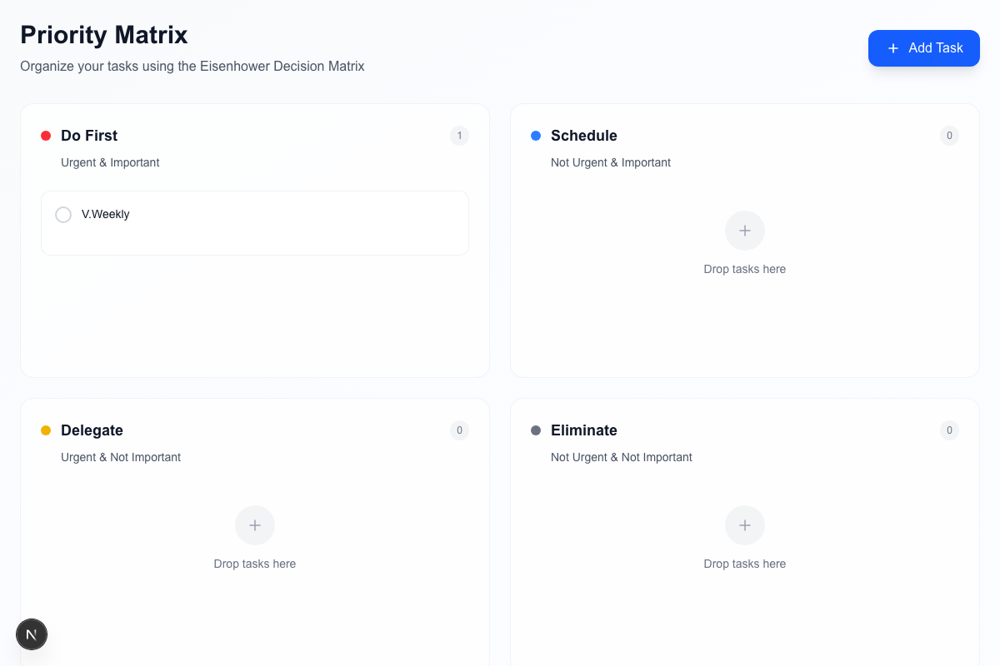

# Priority Matrix - Eisenhower Matrix Task Manager

A web application that helps you organize tasks using the Eisenhower Matrix (also known as the Eisenhower Decision Matrix), which categorizes tasks based on urgency and importance.

Inspired by productivity tools like [Appfluence](https://appfluence.com/), this application provides a clean, modern interface for task prioritization using the proven Eisenhower method.



## Features

✅ **Four-Quadrant Matrix**: Organize tasks into Do First, Schedule, Delegate, and Eliminate quadrants
✅ **Drag & Drop**: Seamlessly move tasks between quadrants with smooth animations
✅ **Task Management**: Create, complete, and delete tasks with real-time updates
✅ **Supabase Integration**: Full database persistence with PostgreSQL backend
✅ **Modern Glass Design**: Beautiful glassmorphism UI with gradient backgrounds
✅ **Responsive Design**: Optimized for desktop and mobile devices
✅ **Enhanced Schema**: Support for task descriptions, priorities, due dates, and user assignments
✅ **Optimistic Updates**: Instant UI feedback with automatic error recovery

## Tech Stack

- **Frontend**: Next.js 15 (React), TypeScript
- **Styling**: Tailwind CSS
- **Drag & Drop**: @dnd-kit
- **Database**: Supabase (PostgreSQL)
- **Deployment**: Vercel
- **UI Components**: Headless UI

## Quick Start

### Prerequisites

- Node.js 18+
- A Supabase account
- Git

### Installation

1. **Clone the repository:**
```bash
git clone <your-repo-url>
cd priority-matrix-clone
```

2. **Install dependencies:**
```bash
npm install
```

3. **Set up environment variables:**
```bash
cp .env.local.example .env.local
```

Edit `.env.local` with your Supabase credentials:
```env
NEXT_PUBLIC_SUPABASE_URL=your_supabase_project_url
NEXT_PUBLIC_SUPABASE_ANON_KEY=your_supabase_anon_key
```

4. **Set up the database:**

In Supabase SQL Editor, apply these scripts in order:

Option A — Flyway (recommended)
Run locally with Docker after setting DB_* in `.env.local`:
```bash
npm run migrate
```

Option B — Manual (SQL Editor)
1) `db/migrations/V20240915__create_tasks.sql` (base schema)
2) `db/migrations/V20240916__enhanced_task_schema.sql` (indexes, views)
3) `db/migrations/V20240918__add_sort_index.sql` (manual ordering)
4) (Optional) `db/policies/20240917_enable_rls_dev.sql` (dev RLS policy)

See `db/README.md` for details.

5. **Run the development server:**
```bash
npm run dev
```

Open [http://localhost:3000](http://localhost:3000) to view the application.

## How to Use

1. **Add a Task**: Click "Add Task" button and enter a task title
2. **Move Tasks**: Drag and drop tasks between the four quadrants using the drag handle (⋮⋮)
3. **Complete Tasks**: Click the checkbox to mark tasks as completed
4. **Delete Tasks**: Click the delete button (🗑️) on any task card
5. **Organize by Priority**:
   - **Do First** (Urgent & Important): Critical tasks requiring immediate attention
   - **Schedule** (Not Urgent & Important): Important tasks to plan and schedule
   - **Delegate** (Urgent & Not Important): Tasks that are pressing but can be delegated
   - **Eliminate** (Not Urgent & Not Important): Low-priority tasks to minimize or eliminate

## Project Structure

```
src/
├── app/
│   ├── globals.css
│   ├── layout.tsx
│   └── page.tsx          # Main application page
├── components/
│   ├── AddTaskModal.tsx  # Modal for adding new tasks
│   ├── Quadrant.tsx      # Individual quadrant component
│   └── TaskCard.tsx      # Individual task card component
└── lib/
    └── supabaseClient.ts # Supabase configuration and API functions; includes manual sort order support
```

## API Functions

The application includes the following database operations:

- `getAllTasks()` - Fetch all tasks from database
- `createTask(title, quadrant, description?, priority?, due_date?, user_id?)` - Create a new task
- `updateTask(id, updates)` - Update an existing task (supports all fields)
- `deleteTask(id)` - Delete a task

## Deployment

See [DEPLOYMENT.md](./DEPLOYMENT.md) for detailed deployment instructions to Vercel with Supabase.

## Development

### Available Scripts

- `npm run dev` - Start development server
- `npm run build` - Build for production
- `npm run start` - Start production server
- `npm run lint` - Run ESLint

### Contributing

1. Fork the repository
2. Create a feature branch
3. Make your changes
4. Add tests if applicable
5. Submit a pull request

## License

This project is open source and available under the [MIT License](LICENSE).

## Acknowledgments

- **Design Inspiration**: [Appfluence](https://appfluence.com/) - A beautiful productivity platform that inspired the modern, clean UI design
- Built with [Next.js](https://nextjs.org/)
- Database powered by [Supabase](https://supabase.com/)
- Drag and drop by [dnd kit](https://dndkit.com/)
- UI components from [Headless UI](https://headlessui.com/)
- Styled with [Tailwind CSS](https://tailwindcss.com/)
